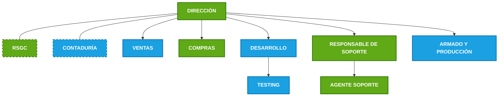

<link rel="stylesheet" href="../../reporte-estilo.css">

# ORGANIGRAMA DE CORVUS S.R.L. (V2)

| DOCUMENTO DE APOYO | ORG-V2 |
| :--- | :--- |
| **ORGANIGRAMA CORPORATIVO** | **Rev. 01** |
| **Fecha de Emisión:** 13/01/2026 | **Responsable:** RSGC |

---

Este diagrama representa la estructura organizativa de Corvus S.R.L., destacando las áreas dentro y fuera del alcance del Sistema de Gestión de Calidad (SGC).

### Referencias

* **Color Verde:** Dentro del alcance del SGC.
* **Color Azul:** Fuera del alcance del SGC.
* **Borde Punteado:** Departamento externo / No interno (Freelance o Staff externo).

