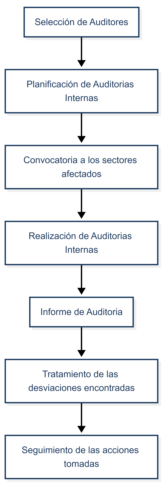

<link rel="stylesheet" href="../../reporte-estilo.css">

# PG 04 - Auditorías Internas - Rev. 04

| PROCEDIMIENTO | PG 04 |
| :--- | :--- |
| **AUDITORÍAS INTERNAS** | **Rev. 04** |
| **Fecha Emisión:** 09/08/2021 | **Fecha Revisión:** 04/01/2026 |
| **Elabora:** Responsable de SGC | **Revisa y Aprueba:** Dirección |

---

## 1. OBJETIVO

Definir y establecer la metodología para verificar que todos los elementos que integran el Sistema de Gestión de Calidad cumplen los requisitos de la norma y los propios de la organización, y que se han implementado y se mantienen de manera eficaz.

## 2. ALCANCE

Todos los sectores de la empresa incluidos en el Sistema de Gestión de Calidad.

## 3. RESPONSABILIDADES

- **La Dirección:** Selecciona los auditores, aprueba el programa de auditorías y garantiza los recursos para la realización de auditorías.
- **Los Auditores Internos:** Son responsables de la aplicación de este procedimiento.

## 4. DEFINICIONES Y ABREVIATURAS

- **SGC:** Sistema de Gestión de Calidad.
- **APPSHEET:** Interfaz digital (Frontend) utilizada para la carga y gestión de registros operativos y de calidad.
- **BACKEND:** Hojas de cálculo (Google Sheets) donde se almacenan los datos recolectados por AppSheet.

## 5. DESARROLLO DEL PROCESO

Para la planificación, seguimiento y registro de las auditorías se utilizará **AppSheet**, asegurando la centralización de la información.

- El módulo de **AUDITORÍAS** hace interfaz con el **RPG 04 03 - Gestión de Auditorías**, unificando la planificación (agenda) y el historial de ejecución.
- Este módulo incorpora también los informes de **Auditorías Externas** (de certificación o mantenimiento), permitiendo una visualización integral del desempeño del sistema.

    

### 5.1 Selección de Auditores

La Dirección es responsable de seleccionar o formar un grupo de personas con el perfil necesario para ser Auditor Interno. Se deben mantener registros de su capacitación (CV / RPG 06 01).

Los Auditores Internos podrán conducir auditorías tras superar la capacitación, contar con el certificado correspondiente y acreditar experiencia en al menos 2 auditorías de entrenamiento como observadores.

Se podrán contratar auditores externos si se considera necesario, quienes deberán demostrar su calificación y experiencia.

### 5.2 Planificación de Auditorías

Se realizarán según el *RPG 04 03 Gestión de Auditorías*, donde se definen las fechas planificadas aprobadas por la Dirección. Todos los elementos del SGC deben revisarse al menos una vez al año. Los auditores deben ser independientes del sector a auditar para asegurar objetividad e imparcialidad.

### 5.3 Convocatoria

Los Auditores Internos deben comunicar al sector involucrado el alcance y fecha de la auditoría con antelación para asegurar la disponibilidad de personal y acceso a las plataformas digitales involucradas.

### 5.4 Realización de la Auditoría

Los auditores pueden utilizar una grilla de guía. En el contexto de la digitalización del SGC, la auditoría incluye:

- **Verificación de Registros Digitales:** Muestreo de registros en AppSheet para verificar que el flujo de datos (Carga -> Registro -> Cierre) se cumpla según lo definido en el sistema.

Tras la verificación, se elabora un informe formal en formato documento (Word o PDF), el cual se almacena en la carpeta correspondiente del servidor/nube y se vincula en el registro unificado *RPG 04 03 Gestión de Auditorías* para completar la trazabilidad (Planificación -> Ejecución -> Informe).El uditor puede utilizar el template RPG 04 02 Informe de Auditoría para la redacción del informe.

**Tipos de hallazgos:**

- **No conformidades (NC):** Desviaciones graves. Se tratan según *PG 03*. Su registro inicial puede realizarse en el Módulo de Calidad de AppSheet para seguimiento.
- **Observaciones (Obs):** Desviaciones leves. Se tratan como NC de procesos.
- **Conformidad (Ok):** Cumplimiento de requisitos.
- **Oportunidades de Mejora (OM):** Sugerencias del auditor para optimizar el uso de las herramientas digitales o procesos.

### 5.5 Seguimiento

El Encargado del sector auditado debe tomar acciones correctivas sin demora. El Responsable del SGC verifica la eficacia de las acciones. En el caso de NC registradas digitalmente, el cierre se valida a través de la propia plataforma AppSheet.

## 6. REGISTROS ASOCIADOS

| Código | Nombre |
| --- | --- |
| RPG 04 02 | Informe de Auditoría |
| RPG 04 03 | Gestión de Auditorías (Plan e Historial) |

## 7. HISTORIAL DE CAMBIOS

| Fecha | Revisión | Descripción | Responsable |
| --- | --- | --- | --- |
| 09/08/2021 | 00 | Documento inicial | RSGC |
| 10/05/2022 | 01 | Actualización de requisitos (5.1) y responsable (5.5). | RSGC |
| 08/10/2024 | 02 | Actualización logo corvus. | RSGC |
| 03/01/2026 | 03 | Integración de auditoría de registros digitales (AppSheet) y verificación de integridad del Backend (Google Sheets). Clarificación del almacenamiento del informe en formato documento. | RSGC |
| 04/01/2026 | 04 | 5.1. Simplificacion de criterio de selección de auditores. Unificación de registros RPG 04 01 y RPG 04 03 en un único registro de gestión integral (RPG 04 03). | RSGC |
| 13/01/2026 | 05 | Estandarización de encabezados digitales y optimización de la trazabilidad normativa (Cláusula 7.5). | RSGC |
