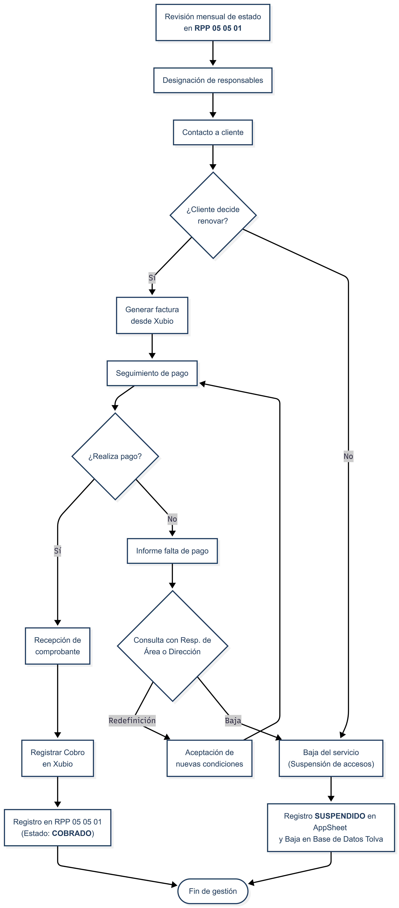

<link rel="stylesheet" href="../../reporte-estilo.css">

# PP 05 05 - Cobranza de Conectividades - Rev. 03

| PROCEDIMIENTO PARTICULAR | PP 05 05 |
| :--- | :--- |
| **COBRANZA DE CONECTIVIDADES** | **Rev. 03** |
| **Fecha Emisión:** 19/06/2025 | **Fecha Revisión:** 24/02/2026 |
| **Elabora:** Responsable de Post Venta | **Revisa y Aprueba:** Dirección |

---

## 1. OBJETIVO

Definir y establecer la metodología para asegurar la facturación de cobranza de las licencias anuales de los clientes activos.

## 2. ALCANCE

Servicio de cobranza de conectividades.

## 3. DEFINICIONES Y ABREVIATURAS

- **AppSheet:** CRM y Sistema de Gestión centralizado de la empresa.
- **Xubio:** Aplicación web para gestiones contables y facturación (ARCA).

## 4. RESPONSABILIDADES

El área de **Post Venta** es responsable de la ejecución del proceso. El **Responsable del Área** interviene en casos de morosidad persistente para definir el curso de acción. La **Dirección** interviene cuando no hay acuerdo o se requiere autorización para la baja del servicio.

## 5. DESARROLLO DEL PROCESO

Para el seguimiento, desarrollo y registro se utilizará **AppSheet**, lo que asegura trazabilidad en tiempo real. Cada cambio de estado inicia un contador automático que permite medir los días transcurridos en cada etapa, constituyendo la evidencia de las acciones realizadas.

- El módulo de **CONECTIVIDADES** hace interfaz con **RPP 05 05 01** - Planilla de Conectividades.

Todas las conectividades corresponden a **renovaciones anuales**. No se realizan renovaciones parciales ni prorrateos, salvo acuerdo puntual con autorización de Dirección.

### 5.1 Asignación y Revisión mensual

Antes del primer día hábil de cada mes, el **Responsable del Área** en conjunto con **Dirección** revisan los vencimientos del período en el módulo **CONECTIVIDADES** de AppSheet y asignan el campo **"QUIEN COBRA"** con el nombre del responsable de cada cobranza. Sin esta asignación el proceso no puede iniciarse.

Estado resultante: **ASIGNADA**

Una vez asignados, cada agente revisa las cuentas bajo su cargo y da comienzo al proceso de contacto.

### 5.2 Contacto y Negociación

El agente contacta al cliente vía WhatsApp/Teléfono informando el vencimiento y precio de la renovación anual.

Las condiciones de pago aceptadas son: **transferencia bancaria** y **cheque** con plazo máximo de 60 días (15, 30, 45 o 60 días).

Estado resultante: **PRIMER CONTACTO**

- **Acepta:** se procede a facturar (ver 5.3).
- **No responde:** el agente realiza un segundo intento. Estado resultante: **SEGUNDO CONTACTO**. Si tampoco responde, se eleva al Responsable del Área para definir el curso de acción.
- **No quiere renovar:** el agente puede elevar el caso al Responsable del Área para intentar la retención del cliente. Si no hay acuerdo, se procede a la baja (ver 5.6).

### 5.3 Facturación (Xubio)

Se emite la factura desde **Xubio**. El agente registra el nuevo estado en AppSheet.

Estado resultante: **FACTURA PENDIENTE DE PAGO**

### 5.4 Seguimiento de Deudores

Si transcurridos los días desde la factura no hay pago, el agente registra cada gestión de cobro como un cambio de estado, dejando evidencia de la acción realizada y reiniciando el contador:

- Primer reclamo → **FACTURA PENDIENTE - RECLAMO DE PAGO**
- Sin respuesta → **FACTURA PENDIENTE - 2° RECLAMO DE PAGO** → se eleva al Responsable del Área o Dirección para definir el curso de acción:
  - **Redefinición:** si se aprueban nuevas condiciones, se reinicia el seguimiento de pago.
  - **Sin acuerdo:** se procede a la baja (ver 5.6).

### 5.5 Verificación de Pago y Registro de Cobro

El cliente envía el comprobante de pago. El agente verifica el ingreso en la cuenta bancaria.

*Nota:* la conciliación entre AppSheet (gestión operativa) y Xubio (gestión contable) es **manual**. No existe sincronización automática de saldos.

Una vez confirmado el ingreso:

1. Se cambia el estado en AppSheet a **COBRADA** (o **COBRADA (CHEQUES)** si el pago fue con cheque).
2. Se asienta el pago en Xubio para cerrar el ciclo contable.

### 5.6 Baja del Servicio (Suspensión)

Ante la falta de pago definitiva o decisión de no renovar:

1. Se notifica al cliente que el servicio será suspendido y que no podrá acceder al sistema.
2. Se suspende el acceso al usuario y la tolva desde el panel de usuario administrador.
3. Se registra el estado como **SUSPENDIDO** en el módulo de Conectividades de AppSheet.
4. Se cambia el campo **TIPO** de **"Cliente"** a **"Baja"** en el módulo **Base de Datos Tolva**. El equipo deja de aparecer en la vista **BASE DE DATOS (TÉCNICO)** y pasa a la vista **BAJA CLIENTES**, quedando fuera de los listados operativos activos.

**Reactivación:** un cliente suspendido puede reactivar el servicio en cualquier momento sin costo adicional. Al recibir y confirmar el pago, el agente restaura el acceso desde el panel de administrador y registra el estado como **COBRADA**.

### 5.7 Conectividades Bonificadas

Por decisión de **Dirección**, ciertas conectividades pueden quedar bonificadas sin costo para el cliente:

- **BONIFICADA:** bonificación por período acordado, aplicada a criterio de Dirección.
- **BONIFICADA 1 AÑO (CONCESIONARIO):** aplicada a clientes provenientes del canal de concesionarios, con el primer año de conectividad sin costo.

En ambos casos el estado se registra directamente en AppSheet sin pasar por el proceso de facturación.

## 6. INDICADORES

El seguimiento de la gestión se realiza a través del **Dashboard de KPIs de AppSheet**, que calcula automáticamente las siguientes métricas para el mes en curso:

| Indicador | Descripción |
| :--- | :--- |
| **Velocidad de Cobro al Día 15** | % de cuentas cobrables cobradas antes del día 15 del mes. Mide la eficiencia en la primera quincena. |
| **Velocidad de Cobro a Fin de Mes** | % de cuentas cobrables cobradas en cualquier momento del mes. Indica la tasa de cobro global mensual. |
| **Suspendidas este Mes** | Cantidad de cuentas que pasaron a estado SUSPENDIDO durante el mes en curso. |
| **Universo Cobrable del Mes** | Total de cuentas con vencimiento en el mes, excluyendo suspendidas y bonificadas. Base de cálculo de los indicadores de velocidad. |
| **Salud de Seguimiento** | Cantidad de cuentas del mes con alerta activa (🚨). Un valor 0 indica seguimiento saludable. |

## 7. REGISTROS ASOCIADOS

- RPP 05 05 01 Planilla de Conectividades (AppSheet).

## 8. HISTORIAL DE CAMBIOS

| Fecha | Rev. | Descripción | Responsable |
| :--- | :--- | :--- | :--- |
| 19/06/2025 | 00 | Emisión inicial. | RSGC |
| 02/01/2026 | 01 | Incorporación de AppSheet y casos especiales. | RSGC |
| 04/01/2026 | 02 | Clarificación de interfaz con AppSheet (puntos 5.6 y 5.7). Actualización de diagrama: inclusión de baja operativa, mejora en lógica de deudores y unificación de términos con Xubio. | RSGC |
| 24/02/2026 | 03 | Reescritura integral punto 5: estados AppSheet documentados por etapa, renovación anual sin prorrateo, proceso de retención, reactivación de suspendidos, sección de conectividades bonificadas; corrección nombres de estados (FACTURADO→FACTURA PENDIENTE DE PAGO, COBRADO→COBRADA); corrección responsabilidades; imagen a formato markdown; actualización sección 6 con KPIs reales del dashboard (Velocidad Día 15, Velocidad Fin de Mes, Suspendidas, Universo Cobrable, Salud de Seguimiento); incorporación de condiciones de pago aceptadas en 5.2. | RSGC |
