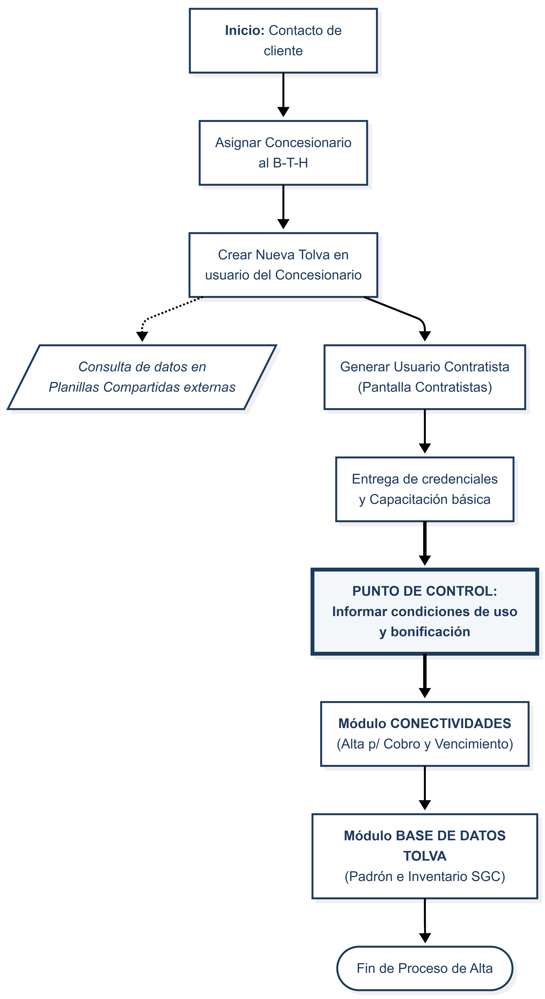

<link rel="stylesheet" href="../../reporte-estilo.css">

# PP 05 06 - Procedimientos para nuevos equipos provenientes de concesionarios - Rev. 02

| PROCEDIMIENTO PARTICULAR | PP 05 06 |
| :--- | :--- |
| **NUEVOS EQUIPOS (CONCESIONARIOS)** | **Rev. 02** |
| **Fecha Emisión:** 29/09/2025 | **Fecha Revisión:** 13/01/2026 |
| **Elabora:** Responsable de Post Venta | **Revisa y Aprueba:** Dirección |

---

## 1. OBJETIVO

Definir y establecer la metodología para asegurar el funcionamiento y configuración del equipo y la debida instrucción del cliente para equipos nuevos provenientes por ventas de concesionarios.

## 2. ALCANCE

Servicio de Post Venta.

## 3. DESARROLLO DEL PROCESO

    

El proceso comienza cuando un cliente se comunica con el soporte de Corvus y el agente de soporte identifica que el cliente adquirió un equipo por venta a través de “concesionarios”.

### 3.1 Verificaciones y Configuración Técnica (Maruiz)

#### 3.1.1 Realizar asignación a concesionario

1. Ingresar a **Maruiz**.
2. Ir a pantalla **“Balanzas”**.
3. En el B-T-H- a asignar, seleccionar lápiz de edición.
4. Seleccionar el concesionario que corresponda y grabar.

#### 3.1.2 Crear nueva tolva para el B-T-H- en concesionario

1. Ingresar al usuario del concesionario.
2. Ingresar al menú de tolva > Seleccionar **Nueva Tolva**.
3. Ingresar número de serie y modelo de la tolva.
    *Nota: Actualmente estos datos se obtienen de las **Planillas Compartidas externas** (Spreadsheets).*

4. Asignar el B-T-H- y guardar.

### 3.2 Generación de Usuario e Instrucción

#### 3.2.1 Proceso de Alta y Capacitación

1. Ingresar a **Maruiz** > Pantalla **“Contratistas”** > Nuevo.
2. Ingresar los datos de usuario y grabar.
3. Compartir con el cliente el acceso generado y el link `www.agpd.com.ar`.
4. Transmitir al cliente los aspectos básicos de utilización (uso de tablet, carga de establecimientos, etc.).
5. **Comunicación de Condiciones de Uso:** Informar al cliente sobre el periodo de bonificación vigente y la modalidad de servicio posterior (suscripción para acceso a plataforma vs. uso local sin costo).

> **Punto de Gestión:** El aseguramiento de esta comunicación es clave para evitar discrepancias en la futura gestión de cobranza y garantizar la transparencia del servicio.

### 3.3 Actualización de Registros (AppSheet)

Toda la información del nuevo equipo debe quedar asentada en la aplicación centralizada para asegurar su trazabilidad y facturación futura.

#### 3.3.1 Módulo CONECTIVIDADES (AppSheet)

* **Actualizar Datos:** Incorporar fila de conectividades USUARIO, DATOS DE CONTACTO y MES DE VENCIMIENTO. Si el usuario ya tenía un equipo activo, actualizar el número de equipos para el cobro.
* **Observaciones:** Indicar en observaciones el concesionario de procedencia y cualquier condición especial de la venta.

#### 3.3.2 Módulo BASE DE DATOS TOLVA (AppSheet)

Este módulo funciona como el **Padrón Histórico de Equipos**. Una vez realizada la vinculación técnica en el sistema administrativo (Maruiz), se deben reflejar los cambios aquí para fines de inventario y SGC:

* **Actualizar Registro:** Asignar al B-T-H el nuevo USUARIO, BALANZA y VENDEDOR.
* **Estado:** Cambiar o verificar el estado del equipo como "Activo".
* **Trazabilidad:** Asegurar que los datos coincidan con lo configurado en el sistema técnico.

---

## 6. HISTORIAL DE CAMBIOS

| Fecha | Rev. | Descripción | Responsable |
| :--- | :--- | :--- | :--- |
| 29/09/2025 | 00 | Emisión inicial. | RSGC |
| 04/01/2026 | 01 | Actualización de registros: Cambio de Base de Datos vieja por Módulos de AppSheet Actualización de registros a AppSheet. Inclusión de proceso de comunicación de condiciones de uso y bonificación (4.3.5). Adición de diagrama de flujo. | RSGC |
| 13/01/2026 | 02 | Corrección de formato de encabezados. | RSGC |
